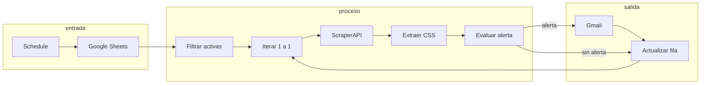
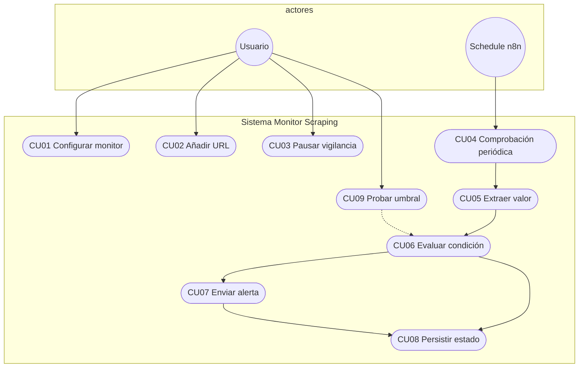
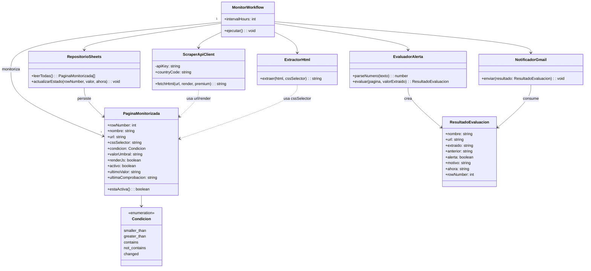
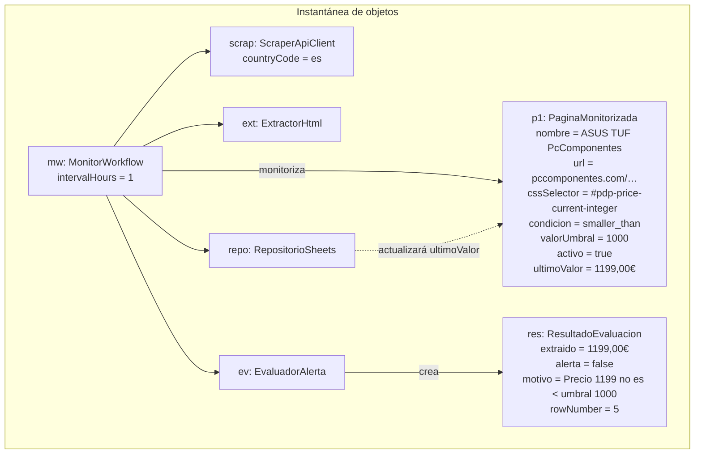
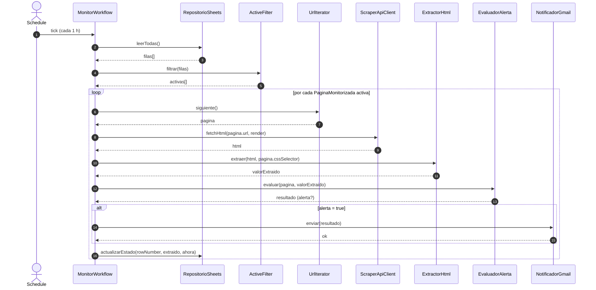
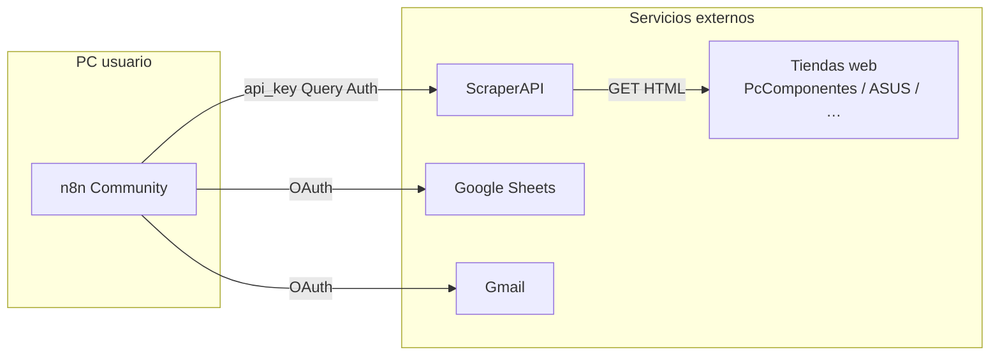

# Documentación — Monitor web scraping multi-URL (n8n + ScraperAPI)

Documentación de **usuario**, **desarrollador**, **funcionalidades**, **casos de uso** y **diagramas UML** (Mermaid) del sistema de vigilancia de precios/textos en páginas web.

| Artefacto | Ruta |
|-----------|------|
| Guía de puesta en marcha | [`configurar-monitor-web-scraping.md`](./configurar-monitor-web-scraping.md) |
| Workflow importable | [`workflows/monitor-web-scraping.json`](./workflows/monitor-web-scraping.json) |
| Filtrar filas activas | [`workflows/filtrar-activas-scraping.js`](./workflows/filtrar-activas-scraping.js) |
| Evaluar alerta (precios ES) | [`workflows/evaluar-alerta-scraping.js`](./workflows/evaluar-alerta-scraping.js) |
| Extraer precio MediaMarkt (alternativa) | [`workflows/extraer-precio-mediamarkt.js`](./workflows/extraer-precio-mediamarkt.js) |

Sistema hermano (empleo público JCyL): [`configurar-monitor-jcyl-convocatorias.md`](./configurar-monitor-jcyl-convocatorias.md).

---

## 1. Visión general

El monitor lee una hoja de **Google Sheets** (una fila = una URL), descarga el HTML vía **ScraperAPI**, extrae un valor con **CSS**, evalúa una **condición** y, si se cumple, envía un **email Gmail**. Después guarda el valor y la hora de comprobación en la misma fila.

---

## 2. Funcionalidades

| ID | Funcionalidad | Descripción |
|----|---------------|-------------|
| F1 | Multi-URL | Varias páginas distintas en la misma hoja; cada una con su selector y regla |
| F2 | Scraping antibot | Descarga HTML con ScraperAPI (`render`, `premium` opcional, `country_code=es`) |
| F3 | Extracción CSS | Nodo HTML con selector por fila (ej. `#pdp-price-current-integer`) |
| F4 | Condiciones | `smaller_than`, `greater_than`, `contains`, `not_contains`, `changed` |
| F5 | Precios ES | Parser de `1.199,00€` / `1099.99` sin falsos positivos |
| F6 | Baseline | Primera ejecución con `Pendiente`/vacío no alerta en `changed`; guarda estado |
| F7 | Alertas Gmail | Email con nombre, URL, motivo, valor anterior y actual |
| F8 | Persistencia | Actualiza `Ultimo_Valor` y `Ultima_Comprobacion` por `row_number` |
| F9 | Activación | `Activo=SI/NO` para pausar filas sin borrarlas |
| F10 | Fallback MediaMarkt | Script opcional por JSON-LD (dominio suele exigir plan premium ScraperAPI) |

### Limitaciones conocidas

- **MediaMarkt** y dominios muy protegidos: ScraperAPI pide `premium` / `ultra_premium`; el plan free suele fallar.
- Selectores con clases generadas (`mms-ui-…`) son frágiles; preferir `id` / `data-*`.
- Puppeteer **no** está en n8n core (`n8n-nodes-puppeteer` es comunitario).
- Variables UI (`$vars`) son de plan de pago; la API key va en credencial **Query Auth**.

---

## 3. Documentación de usuario

### 3.1 Requisitos

- n8n local (Community)
- Cuenta Google (Gmail + Sheets OAuth)
- Cuenta ScraperAPI + credencial Query Auth (`api_key`)
- Hoja **Control Scraping Webs**

### 3.2 Modelo de datos (hoja)

| Columna | Obligatorio | Uso |
|---------|-------------|-----|
| Nombre | Sí | Asunto del email |
| URL | Sí | Ficha o página a vigilar (sin tracking `gclid` / `srsltid` si es posible) |
| CSS_Selector | Sí* | Selector del dato (*salvo ruta MediaMarkt por JSON-LD) |
| Condicion | Sí | Ver tabla de condiciones |
| Valor_Umbral | Según condición | Número o texto |
| Render_JS | No | `SI` = JS renderizado (más créditos) |
| Activo | Sí | `SI` / `NO` |
| Ultimo_Valor | Auto | No editar salvo forzar baseline |
| Ultima_Comprobacion | Auto | Fecha/hora última pasada |

### 3.3 Condiciones (usuario)

| Condicion | Cuándo avisa | Ejemplo |
|-----------|--------------|---------|
| `smaller_than` | Número extraído &lt; umbral | Portátil &lt; 1000 € |
| `greater_than` | Número &gt; umbral | Stock / contador |
| `contains` | Texto contiene umbral | “En stock” |
| `not_contains` | Texto no contiene umbral | Desaparece “Agotado” |
| `changed` | Valor ≠ último guardado | Cualquier cambio de precio |

### 3.4 Cómo añadir un producto (checklist)

1. Abrir la ficha del producto.
2. Inspeccionar el **precio actual** → copiar selector estable (`#…`, `[data-…]`).
3. Nueva fila: URL limpia, selector, `smaller_than`, umbral, `Activo=SI`.
4. Test workflow → comprobar `extraido` y `alerta`.
5. Probar email con umbral temporalmente por encima del precio; restaurar umbral real.
6. Publish.

### 3.5 Ejemplos reales validados

| Tienda | Selector | Notas |
|--------|----------|-------|
| books.toscrape.com | `.price_color` | Prueba sin antibot |
| PcComponentes | `#pdp-price-current-integer` | OK con ScraperAPI free |
| eStore ASUS | `[data-price-type="finalPrice"]` | OK; precio ~1099,99 € |
| MediaMarkt | (JSON-LD / premium) | Suele exigir `premium=true` |

### 3.6 Operación diaria

- Intervalo por defecto: **1 hora** (subir a 6–12 h si hay muchas filas o `Render_JS=SI`).
- Pausar: `Activo=NO`.
- Forzar re-baseline en `changed`: poner `Ultimo_Valor=Pendiente`.

Detalle de credenciales y nodos: [`configurar-monitor-web-scraping.md`](./configurar-monitor-web-scraping.md).

---

## 4. Casos de uso

### 4.1 Catálogo de casos de uso

| ID | Nombre | Actor primario | Objetivo |
|----|--------|----------------|----------|
| CU01 | Configurar monitor | Usuario | Crear hoja, credenciales e importar workflow |
| CU02 | Añadir URL a vigilar | Usuario | Registrar producto/página con regla de alerta |
| CU03 | Pausar vigilancia | Usuario | Desactivar fila sin borrarla |
| CU04 | Ejecutar comprobación periódica | Sistema (Schedule) | Recorrer URLs activas |
| CU05 | Extraer valor de página | Sistema | Obtener precio/texto vía CSS o JSON-LD |
| CU06 | Evaluar condición | Sistema | Decidir si hay alerta |
| CU07 | Enviar alerta | Sistema | Notificar por Gmail |
| CU08 | Persistir estado | Sistema | Guardar valor y marca temporal |
| CU09 | Probar umbral | Usuario | Forzar email bajando/subiendo umbral temporalmente |

### 4.2 Diagrama de casos de uso (UML)

### 4.3 Escenarios narrativos

**CU02 — Vigilancia de portátil PcComponentes**

1. El usuario añade la ficha ASUS TUF con selector `#pdp-price-current-integer`, condición `smaller_than`, umbral `1000`.
2. El sistema, en cada ciclo, extrae p. ej. `1199,00€`.
3. Como 1199 ≮ 1000, no envía email; actualiza `Ultimo_Valor`.
4. Si el precio baja a 999, envía Gmail y actualiza de nuevo.

**CU07 — Prueba eStore ASUS**

1. Usuario pone umbral `1100` con precio `1099,99 €`.
2. Sistema evalúa `1099.99 < 1100` → `alerta=true`.
3. Gmail notifica; usuario restaura umbral `1000`.

---

## 5. Documentación de desarrollador

### 5.1 Arquitectura lógica

Componentes (no son clases Java; son nodos/módulos del workflow):

| Componente | Tipo n8n / archivo | Responsabilidad |
|------------|--------------------|-----------------|
| ScheduleTrigger | `scheduleTrigger` | Disparo temporal |
| SheetsReader | `googleSheets` read | Cargar filas |
| ActiveFilter | Code `filtrar-activas-scraping.js` | Normalizar A–I / nombres; filtrar `Activo=SI` |
| UrlIterator | `splitInBatches` | Procesar de 1 en 1 |
| HtmlFetcher | `httpRequest` + ScraperAPI | Obtener HTML texto |
| CssExtractor | `html` extractHtmlContent | Aplicar CSS de la fila |
| AlertEvaluator | Code `evaluar-alerta-scraping.js` | Condiciones + parseo numérico ES |
| MediaMarktExtractor | Code `extraer-precio-mediamarkt.js` | Alternativa JSON-LD (opcional) |
| AlertGateway | `if` + `gmail` | Ramificar y notificar |
| SheetsWriter | `googleSheets` update | Match `row_number` |

### 5.2 Diagrama de clases (UML)

Modelo de dominio orientado a objetos que representa el diseño (independiente de la UI de n8n):

### 5.3 Diagrama de objetos (UML)

Instantánea tras una ejecución correcta sobre PcComponentes (precio 1199 €, umbral 1000, sin alerta):

### 5.4 Diagrama de secuencia (UML)

Comprobación de una URL activa con alerta verdadera (ej. umbral de prueba 1100):

### 5.5 Mapeo clase → implementación

| Clase (diseño) | Implementación |
|----------------|----------------|
| MonitorWorkflow | Workflow JSON + Schedule |
| PaginaMonitorizada | Fila Google Sheets |
| ScraperApiClient | Nodo HTTP Request → `api.scraperapi.com` |
| ExtractorHtml | Nodo `n8n-nodes-base.html` |
| EvaluadorAlerta | `evaluar-alerta-scraping.js` |
| NotificadorGmail | Nodo Gmail |
| RepositorioSheets | Nodos Google Sheets read/update |

### 5.6 Extender el sistema

1. **Nueva condición:** ampliar `evaluar-alerta-scraping.js` y documentar en la tabla de condiciones.
2. **Nueva tienda con antibot fuerte:** probar `Render_JS=SI` → `premium=true`; si falla, script específico (patrón MediaMarkt) o otra fuente.
3. **Mezclar CSS y MediaMarkt:** IF por dominio (`mediamarkt.es` vs resto) antes del extractor.
4. **Puppeteer:** instalar `n8n-nodes-puppeteer` y sustituir solo el fetcher.

### 5.7 Pruebas recomendadas (desarrollador)

| Prueba | Entrada | Esperado |
|--------|---------|----------|
| Parse ES | `1.199,00€` | `1199` |
| Parse US/ASUS attr | `1099.99` | `1099.99` |
| smaller_than false | 1199 vs 1000 | `alerta=false` |
| smaller_than true | 1099.99 vs 1100 | `alerta=true` + email |
| Filtro | Activo=NO | No entra al bucle |
| Update | tras evaluación | H/I de la hoja rellenados |

---

## 6. Diagrama de despliegue (contexto)

---

## 7. Glosario

| Término | Significado |
|---------|-------------|
| Baseline | Primer valor guardado sin alerta (`changed`) |
| Premium ScraperAPI | Modo antibot de pago / alto consumo de créditos |
| row_number | Índice de fila que n8n usa para actualizar Sheets |
| Render_JS | Parámetro `render=true` en ScraperAPI |

---

## 8. Historial de versiones del documento

| Fecha | Cambio |
|-------|--------|
| 2026-09-03 | Versión inicial: usuario, desarrollador, funcionalidades, CU y UML (clases, objetos, secuencia, casos de uso) |
