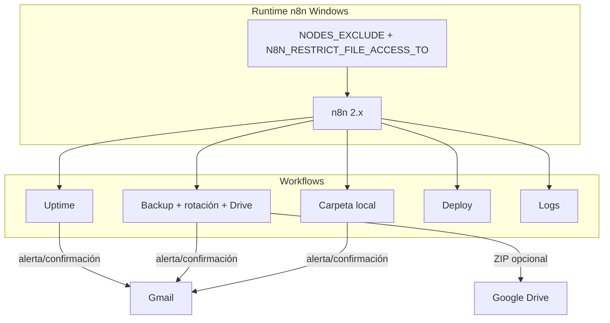
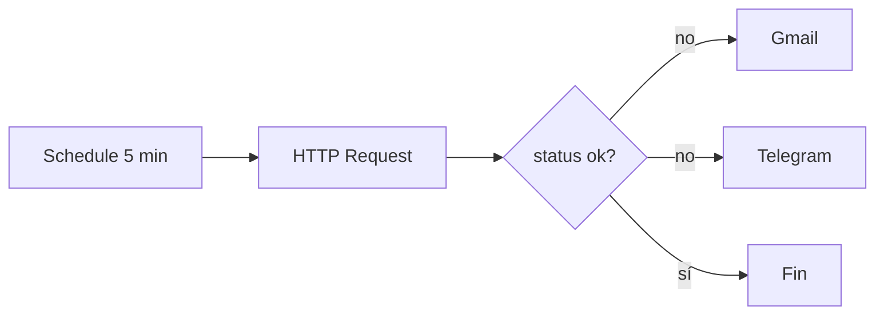
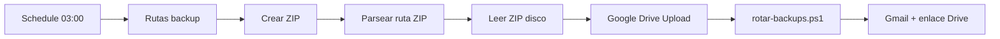
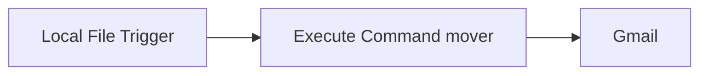
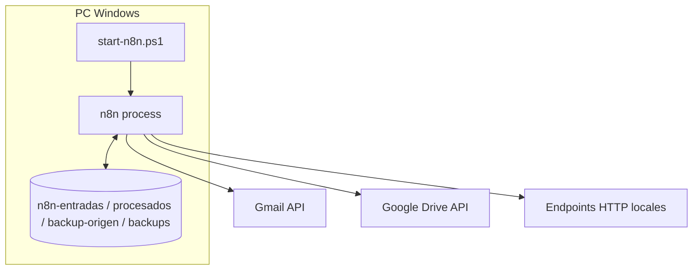
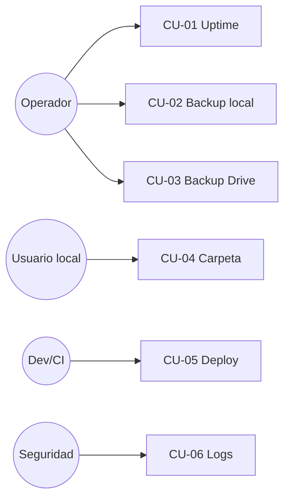

# Documentación — Workflows de sistemas (n8n local Windows)

Documentación de **usuario**, **desarrollador**, **requisitos funcionales/no funcionales**, **casos de uso** y **diagramas UML** (Mermaid) de los patrones de automatización de sistemas en n8n self-hosted.

| Artefacto | Ruta |
|-----------|------|
| Guía operativa | [`configurar-workflows-sistemas.md`](./configurar-workflows-sistemas.md) |
| Arranque recomendado | [`start-n8n.ps1`](./start-n8n.ps1) |
| Uptime | [`workflows/sistemas-uptime-health.json`](./workflows/sistemas-uptime-health.json) |
| Vigilancia carpeta | [`workflows/sistemas-vigilancia-carpeta.json`](./workflows/sistemas-vigilancia-carpeta.json) |
| Backup + rotación | [`workflows/sistemas-backup-rotacion.json`](./workflows/sistemas-backup-rotacion.json) |
| Script ZIP auxiliar | [`workflows/backup-carpeta.ps1`](./workflows/backup-carpeta.ps1) |
| Script rotación ZIP | [`workflows/rotar-backups.ps1`](./workflows/rotar-backups.ps1) |
| Telegram programado | [`workflows/telegram-mensaje-programado.json`](./workflows/telegram-mensaje-programado.json) · guía [`configurar-telegram-mensajes.md`](./configurar-telegram-mensajes.md) |

n8n de referencia: **2.22.6 (Self Hosted)** vía `npx n8n` / `start-n8n.ps1`.

---

## 1. Visión general

Cinco patrones de automatización de sistemas adaptados a Windows: monitor HTTP, backup local (+ nube), vigilancia de carpetas, deploy por webhook y auditoría de logs. Los tres primeros tienen JSON importable y pruebas locales documentadas.

> **Empieza aquí si no has seguido el chat:** la sección [2. Fichas por workflow](#2-fichas-por-workflow-lectura-rápida) resume qué hace / qué no hace / entradas-salidas de cada uno.



---

## 2. Fichas por workflow (lectura rápida)

Pensadas para alguien que **no** ha seguido la conversación de configuración. La guía paso a paso está en [`configurar-workflows-sistemas.md`](./configurar-workflows-sistemas.md).

### 2.1 Uptime / Health Check

| | |
|--|--|
| **Archivo** | [`workflows/sistemas-uptime-health.json`](./workflows/sistemas-uptime-health.json) |
| **Qué hace** | Cada **5 minutos** hace un GET HTTP a una URL configurada. Si el código no es 200–399 (o hay error de red), envía **email Gmail y Telegram** en paralelo. Si todo va bien, **no** notifica. |
| **Qué no hace** | No hace ping por defecto; no mira contenido HTML ni latencia SLA; no reinicia servicios; no sustituye a UptimeRobot/Prometheus. Una sola URL por ejecución (hay que duplicar el flujo o parametrizar para varias). |
| **Tipo de backup** | N/A |
| **Entradas** | Schedule 5 min; URL, nombre y `chatId` en «Definir objetivo»; credenciales Gmail + Telegram. |
| **Salidas** | Email + Telegram solo si falla; datos internos `ok` / `statusCode`. |
| **Estado** | Probado HTTP; Telegram cableado en el JSON (configurar chatId + credencial). |

### 2.2 Backup local + rotación + Google Drive

| | |
|--|--|
| **Archivo** | [`workflows/sistemas-backup-rotacion.json`](./workflows/sistemas-backup-rotacion.json) + [`backup-carpeta.ps1`](./workflows/backup-carpeta.ps1) + [`rotar-backups.ps1`](./workflows/rotar-backups.ps1) |
| **Qué hace** | Cada día (~03:00) comprime **toda** la carpeta origen en un ZIP nuevo, lo sube a **Google Drive**, borra ZIP locales con más de **N días** (default 7) y manda un email de confirmación (con enlace Drive si el upload corrió en esa ejecución). |
| **Qué no hace** | No hace backup de bases de datos (MySQL/Postgres) salvo que tú añadas otro script; no cifra el ZIP; no verifica integridad del ZIP; no restaura automáticamente. |
| **Tipo de backup** | **Completa (full)** en cada ejecución: cada `backup_*.zip` es un snapshot íntegro de la carpeta. **No** es incremental ni diferencial. La «rotación» es solo **retención** (borrar full antiguos), no un esquema encadenado. |
| **Entradas** | Carpetas `n8n-backup-origen` → `n8n-backups`; Schedule; scripts `.ps1`; OAuth Gmail + Google Drive; Drive API habilitada; allow-list de ficheros. |
| **Salidas** | ZIP en disco; archivo en carpeta Drive; email con rutas, rotación (`deleted=…`) y enlace Drive. |
| **Estado** | Cadena Parsear → Leer ZIP → Drive → Rotacion → Gmail documentada y probada. |

### 2.3 Vigilancia de carpeta local

| | |
|--|--|
| **Archivo** | [`workflows/sistemas-vigilancia-carpeta.json`](./workflows/sistemas-vigilancia-carpeta.json) |
| **Qué hace** | Cuando aparece un **archivo nuevo** en `n8n-entradas`, lo **mueve** a `n8n-procesados` y envía un email con origen/destino. |
| **Qué no hace** | No parsea CSV ni OCR por defecto (solo está esbozado en la guía); no vigila subcarpetas de forma avanzada; no procesa el contenido del fichero; no sube a Drive. |
| **Tipo de backup** | N/A (es movimiento de archivo, no copia de seguridad). |
| **Entradas** | Local File Trigger (evento *add*) sobre la carpeta entradas; Execute Command (mover); Gmail. Requiere `NODES_EXCLUDE=[]`. |
| **Salidas** | Archivo en `n8n-procesados`; email de confirmación. |
| **Estado** | Probado (p. ej. PDF movido + email). |

### 2.4 Deploy (Webhook + git / Docker)

| | |
|--|--|
| **Archivo** | **No hay JSON importable**; solo patrón en la guía operativa. |
| **Qué hace** | (Diseño) Recibe un Webhook (p. ej. push a `main`), ejecuta un script local (`git pull` + `docker compose up -d`) y avisa por email/Telegram. |
| **Qué no hace** | No está montado ni probado en este repo; no expone el webhook sin túnel HTTPS; no es un CD completo (tests, rollback, secretos). |
| **Tipo de backup** | N/A |
| **Entradas** | Webhook GitHub + script de deploy en disco + (opcional) túnel. |
| **Salidas** | App/contenedor actualizado + notificación. |
| **Estado** | Solo documentación manual. |

### 2.5 Auditoría de logs / intentos de login

| | |
|--|--|
| **Archivo** | **No hay JSON importable**; solo patrón en la guía operativa. |
| **Qué hace** | (Diseño) Periódicamente lee eventos de seguridad (p. ej. fallos de login) y alerta si supera un umbral. |
| **Qué no hace** | No está montado ni probado aquí; no bloquea IPs por defecto (y no debería sin cuidado); no sustituye a un SIEM. |
| **Tipo de backup** | N/A |
| **Entradas** | Schedule + acceso a logs/Visor de eventos + umbral. |
| **Salidas** | Email crítico si hay anomalía. |
| **Estado** | Solo documentación manual. |

### 2.6 Telegram — mensaje programado

| | |
|--|--|
| **Archivo** | [`workflows/telegram-mensaje-programado.json`](./workflows/telegram-mensaje-programado.json) · [`configurar-telegram-mensajes.md`](./configurar-telegram-mensajes.md) |
| **Qué hace** | Cada día a las **09:00** (configurable) envía un texto a tu chat de Telegram. |
| **Qué no hace** | No escucha comandos del bot; no es conversacional (haría falta Telegram Trigger). |
| **Tipo de backup** | N/A |
| **Entradas** | Token BotFather, `chat_id`, Schedule, texto. |
| **Salidas** | Mensaje en Telegram. |
| **Estado** | JSON listo; falta crear bot + credencial en tu instancia. |

### Resumen rápido

| # | Workflow | JSON | Backup |
|---|----------|------|--------|
| 1 | Uptime | Sí | — |
| 2 | Backup + Drive | Sí | **Full** + retención 7 días |
| 3 | Carpeta | Sí | — |
| 4 | Deploy | No | — |
| 5 | Logs | No | — |
| — | Telegram programado | Sí | — (mensajería, no backup) |

---

## 3. Requisitos funcionales (RF)

| ID | Requisito | Workflow | Estado |
|----|-----------|----------|--------|
| RF-01 | Comprobar cada N minutos que un endpoint HTTP responde 200 | Uptime | Probado (`localhost:5678`) |
| RF-02 | Si el status ≠ 200 (o error de red), enviar alerta Gmail **y Telegram** | Uptime | JSON con ambos canales |
| RF-03 | Crear ZIP diario de una carpeta origen | Backup | Probado |
| RF-04 | Rotar ZIP antiguos (`backup_*.zip` > N días) | Backup | Probado |
| RF-05 | Notificar por Gmail el resultado del backup (ruta ZIP, retención) | Backup | Probado |
| RF-06 | Subir el ZIP a una carpeta de Google Drive (opcional) | Backup | Configurado (API + OAuth) |
| RF-07 | Detectar archivo nuevo en carpeta de entradas | Carpeta | Probado |
| RF-08 | Mover el archivo a carpeta procesados y avisar por Gmail | Carpeta | Probado |
| RF-09 | Ejecutar comandos PowerShell locales de forma controlada | Backup / Carpeta | Requiere `NODES_EXCLUDE=[]` |
| RF-10 | Leer binarios desde disco solo en rutas allow-list | Backup → Drive | Requiere `N8N_RESTRICT_FILE_ACCESS_TO` |
| RF-11 | Webhook + comandos de deploy (git/docker) | Deploy | Documentado (manual) |
| RF-12 | Auditar eventos de autenticación fallida | Logs | Documentado (manual) |
| RF-13 | Enviar mensaje de texto a Telegram en horario programado | Telegram | JSON listo |

---

## 4. Requisitos no funcionales (RNF)

| ID | Tipo | Requisito |
|----|------|-----------|
| RNF-01 | Seguridad | Local File Trigger y Execute Command desactivados por defecto en n8n 2.x; se habilitan solo con `NODES_EXCLUDE='[]'` (o lista explícita sin excluirlos) |
| RNF-02 | Seguridad | Read/Write Files limitado por `N8N_RESTRICT_FILE_ACCESS_TO` (por defecto solo `~\.n8n-files`) |
| RNF-03 | Seguridad | No concatenar input de Webhook público en comandos sin sanitizar |
| RNF-04 | Portabilidad | Rutas Windows absolutas (`C:\Users\…`); expresiones con `/` y `trim` para el nodo de archivos |
| RNF-05 | Operación | Arranque reproducible vía `start-n8n.ps1` y variables de entorno de **Usuario** Windows |
| RNF-06 | Disponibilidad | Workflows Publish; Schedule / Local File Trigger activos tras reinicio de n8n |
| RNF-07 | Observabilidad | Confirmación o alerta por Gmail (`gracobjo@gmail.com` en entorno de prueba) |
| RNF-08 | Retención | Backups locales con rotación configurable (default 7 días) |
| RNF-09 | Integración | Google Drive OAuth2 + **Google Drive API** habilitada en el proyecto de Google Cloud |
| RNF-10 | Usabilidad | Fichas «qué hace / qué no hace» en §2 para onboarding sin contexto del chat |

### Variables de entorno persistidas (Usuario Windows)

Quedan fijadas a nivel **User** (nuevas terminales / sesión tras relogin o abrir PowerShell nuevo):

| Variable | Valor |
|----------|--------|
| `NODES_EXCLUDE` | `[]` |
| `N8N_RESTRICT_FILE_ACCESS_TO` | `%USERPROFILE%\n8n-backups;%USERPROFILE%\n8n-backup-origen;%USERPROFILE%\n8n-entradas;%USERPROFILE%\n8n-procesados;%USERPROFILE%\.n8n-files` |
| `N8N_COMMUNITY_PACKAGES_ENABLED` | `true` |
| `GENERIC_TIMEZONE` | `Europe/Madrid` (hora de España peninsular; Canarias: `Atlantic/Canary`) |

Script equivalente: [`start-n8n.ps1`](./start-n8n.ps1).

```powershell
# Arranque recomendado
powershell -File C:\Users\chuwi\Documents\n8n\start-n8n.ps1
```

Si la sesión actual se abrió **antes** de fijar las variables de Usuario, cierra la terminal o exporta en la sesión:

```powershell
$env:NODES_EXCLUDE = '[]'
$env:N8N_RESTRICT_FILE_ACCESS_TO = "$env:USERPROFILE\n8n-backups;$env:USERPROFILE\n8n-backup-origen;$env:USERPROFILE\.n8n-files"
npx n8n
```

---

## 5. Casos de uso

| ID | Actor | Caso de uso | Flujo principal | Resultado |
|----|-------|-------------|-----------------|-----------|
| CU-01 | Operador | Detectar caída de n8n/servicio local | Schedule → HTTP GET → IF ≠ 200 → Gmail | Email de alerta |
| CU-02 | Operador | Backup diario de carpeta crítica | Schedule 03:00 → ZIP → rotación → Gmail | ZIP en `n8n-backups` + email |
| CU-03 | Operador | Copia en la nube del ZIP | … → Read binary → Google Drive Upload | Fichero en carpeta Drive |
| CU-04 | Usuario local | Archivo cae en bandeja de entrada | Local File Trigger → mover → Gmail | Archivo en `n8n-procesados` |
| CU-05 | CI/Dev | Deploy tras push (manual) | Webhook → Execute Command | Contenedor/app actualizada |
| CU-06 | Seguridad | Revisar intentos de login fallidos | Schedule → parse log → IF umbral → Gmail | Alerta crítica |

### CU-03 — detalle (Google Drive)

**Precondiciones:** Drive API habilitada; OAuth Google Drive en n8n; carpeta destino con ID conocido; nodo Drive **activado**; allow-list de archivos incluye `n8n-backups`.

**Pasos:**

1. Backup local genera `zipPath` / `zipPathPosix` / `fileName`.
2. Read/Write Files (Read) carga el ZIP en binary field `data`.
3. Google Drive (File / Upload) sube `data` a Parent Drive `root` + Parent Folder By ID.
4. Continúa rotación y email (el email puede indicar que Drive está activo).

**Postcondiciones:** El ZIP existe en Drive y en disco (hasta que la rotación lo borre por antigüedad).

**Excepciones:**

| Error | Causa | Acción |
|-------|--------|--------|
| `No file(s) found` | Espacio delante de la ruta, `\` sin normalizar, o carpeta fuera del allow-list | `trim` + `/` + `N8N_RESTRICT_FILE_ACCESS_TO` |
| 403 Drive API | API no habilitada en el proyecto Cloud | Habilitar Google Drive API y reintentar / reconnect OAuth |
| From list gris | Lista de drives no cargada | Usar **By ID** (`root` + folder ID) |
| Nodo no corre | Disabled en canvas | Activate / Enable |

---

## 6. Google Drive — configuración completa

### 6.1 Habilitar Google Drive API (obligatorio)

Sin esto el upload falla con **403** aunque el OAuth de Gmail/Sheets funcione.

1. Abre [Google Cloud Console](https://console.cloud.google.com/) → el proyecto OAuth de n8n (en la prueba: proyecto numérico `947509817186`).
2. **APIs & Services → Library** → busca **Google Drive API**.
3. **Enable**.
4. Espera 1–2 minutos; si sigue 403, en n8n **Credentials → Google Drive → Reconnect** / volver a autorizar scopes de Drive.
5. Comprueba en [Google Drive API](https://console.cloud.google.com/apis/library/drive.googleapis.com) que aparece **Enabled**.

Scopes habituales del nodo: acceso a archivos de Drive del usuario autenticado (no hace falta Service Account para el caso personal).

### 6.2 Credencial en n8n

| Campo | Valor |
|-------|--------|
| Tipo | **Google Drive OAuth2 API** |
| Cuenta de prueba | misma familia que Gmail (`gracobjo@gmail.com`) |
| Consent | Pantalla OAuth del mismo proyecto Cloud |

### 6.3 Carpeta destino

1. En [drive.google.com](https://drive.google.com) crea p. ej. `n8n-backups`.
2. Entra en la carpeta; URL:

```text
https://drive.google.com/drive/folders/18NmjbymVBtT4BTQuIHUg-7kEhFBswO2r
```

3. Copia solo el ID: `18NmjbymVBtT4BTQuIHUg-7kEhFBswO2r`  
   **No** uses la URL de «Mi unidad» (`.../my-drive`).

### 6.4 Nodos y parámetros (canvas)

```text
Parsear ruta ZIP
  → Read/Write Files from Disk (Read)
  → Subir a Google Drive (en la cadena, no solo “Execute step”)
  → Rotacion +7 dias
  → Gmail
```

Si Drive no está cableado entre Parsear y Rotación, el email dirá *«no ejecutado»* aunque un Execute step manual hubiera subido un ZIP antes.

| Nodo | Parámetro | Valor correcto |
|------|-----------|----------------|
| Parsear ruta ZIP | Salida | `zipPath`, `zipPathPosix`, `fileName` (trim, sin espacio inicial) |
| Read/Write Files | Operation | **Read** |
| Read/Write Files | File(s) Selector | `{{ $json.zipPathPosix }}` o `{{ String($json.zipPath).trim().replace(/\\/g, '/') }}` |
| Read/Write Files | Put Output File in Field | `data` |
| Google Drive | Resource / Operation | **File** / **Upload** |
| Google Drive | Input Data Field Name | `data` |
| Google Drive | File Name | `{{ $('Parsear ruta ZIP').item.json.fileName }}` |
| Google Drive | Parent Drive | **By ID** = `root` |
| Google Drive | Parent Folder | **By ID** = `18NmjbymVBtT4BTQuIHUg-7kEhFBswO2r` |
| Rotacion +7 dias | Command | `-File ...\rotar-backups.ps1` (no `-Command` con `$dir`/`$days`) |
| Gmail backup OK | Message | Enlace Drive vía `$('Subir a Google Drive').isExecuted` + `id` / `webViewLink` |

**Notas:**

- **From list** en gris es normal si la credencial no lista drives; **By ID** basta.
- Parent Drive = ID de carpeta → incorrecto; carpeta va solo en Parent Folder.
- Drive debe estar **en la cadena** del Test workflow; un Execute step suelto no cuenta para el email.
- Tras Drive, `$json` ya no trae `backupDir`: Rotacion lee `$('Parsear ruta ZIP')` o usa el `.ps1` con esos args.

### 6.5 Trampa Execute Command + `$` (rotación)

En campos Command con modo expresión (`=` / fx), n8n interpreta tokens como `$dir`, `$days`, `$limit` como variables n8n. Quedan vacíos y PowerShell falla (`$days = ;`, rutas partidas con `\n7`).

**Correcto:** llamar a [`rotar-backups.ps1`](./workflows/rotar-backups.ps1) con `-BackupDir` / `-DaysToKeep`, o escapar dólares PowerShell como `$$` en la expresión.

### 6.6 Diagrama de secuencia — upload Drive

```mermaid
sequenceDiagram
  participant Sch as Schedule
  participant Cmd as Execute Command
  participant Par as Parsear ZIP
  participant Rd as Read Files
  participant Dr as Google Drive API
  participant Gm as Gmail

  Sch->>Cmd: PowerShell ZIP origen→backups
  Cmd->>Par: stdout con ruta .zip
  Par->>Rd: zipPathPosix
  Rd->>Rd: binary data (allow-list)
  Rd->>Dr: files.create (OAuth + Drive API ON)
  Note over Dr: Parent drive=root<br/>folder=18Nmjbym…
  Dr-->>Rd: file metadata
  Rd->>Gm: confirmación (vía nodos siguientes)
```

---

## 7. Diagramas UML / flujos por workflow

### 7.1 Uptime



### 7.2 Backup + rotación (+ Drive)



### 7.3 Vigilancia de carpeta



### 7.4 Diagrama de componentes



### 7.5 Casos de uso (UML)



---

## 8. Carpetas locales de trabajo

| Carpeta | Uso |
|---------|-----|
| `%USERPROFILE%\n8n-entradas` | Vigilancia: archivos nuevos |
| `%USERPROFILE%\n8n-procesados` | Destino tras procesar |
| `%USERPROFILE%\n8n-backup-origen` | Contenido a comprimir |
| `%USERPROFILE%\n8n-backups` | ZIP `backup_YYYY-MM-DD_HHMM.zip` |
| `%USERPROFILE%\.n8n-files` | Allow-list por defecto de n8n 2.x |

---

## 9. Matriz de pruebas (entorno local)

| Prueba | Resultado |
|--------|-----------|
| Uptime → `http://localhost:5678` | HTTP 200, sin alerta |
| Carpeta → PDF en entradas | Movido + email OK |
| Backup ZIP + rotación | ZIP creado; rotación vía `rotar-backups.ps1`; email con `deleted=0` |
| Read binary ZIP | OK tras allow-list + path sin espacio |
| Drive en cadena completa | Cable Parsear → Leer → Drive → Rotacion; email con `open?id=` |
| Rotación con `-Command $dir` | Falla (n8n come `$dir`/`$days`); usar `.ps1` |

---

## 10. Historial de configuración (2026-09-04)

- Habilitados Local File Trigger / Execute Command con `NODES_EXCLUDE='[]'`.
- Allow-list de ficheros ampliada con `N8N_RESTRICT_FILE_ACCESS_TO`.
- Corregido espacio inicial en `zipPath`; añadido `zipPathPosix`.
- Google Drive: Parent Drive By ID `root`; Parent Folder `18NmjbymVBtT4BTQuIHUg-7kEhFBswO2r`.
- 403 resuelto habilitando **Google Drive API** en proyecto Cloud `947509817186`.
- Variables de Usuario + `start-n8n.ps1` para persistir el arranque.
- Email Gmail: quitada nota «Drive desactivado»; muestra enlace si el nodo se ejecutó.
- Cadena obligatoria Parsear → Leer ZIP → Drive → Rotacion (Drive suelto no cuenta).
- Rotación migrada a `rotar-backups.ps1` por conflicto `$` en Execute Command.
- Añadidas fichas por workflow (§2): qué hace / qué no hace / tipo de backup / entradas-salidas.
- `GENERIC_TIMEZONE=Europe/Madrid` en arranque; guía Telegram con mapa «dónde se configura» (chat_id, credencial, timezone workflow vs nodo).
