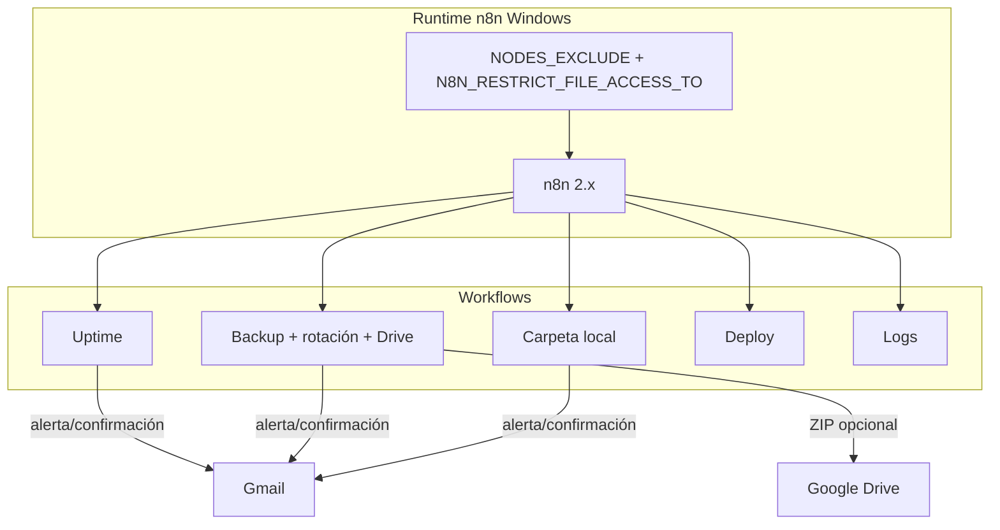
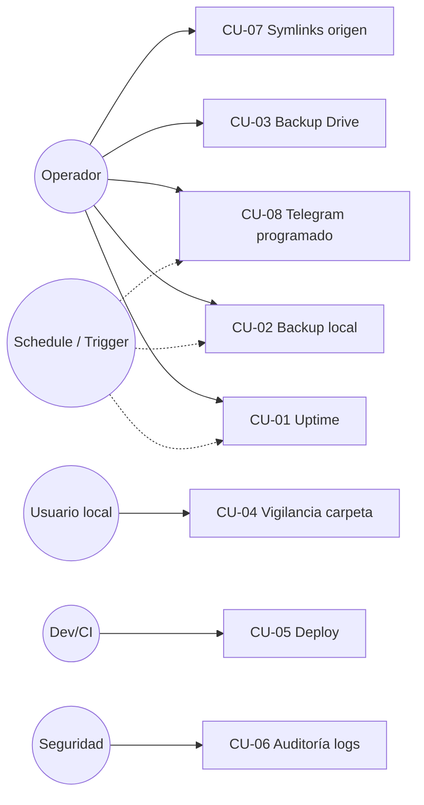
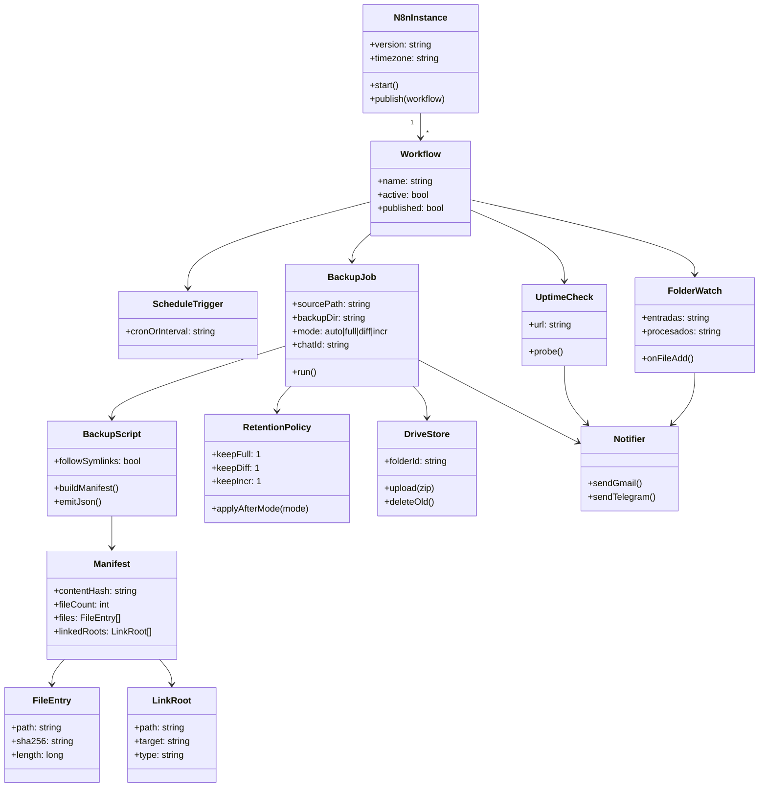
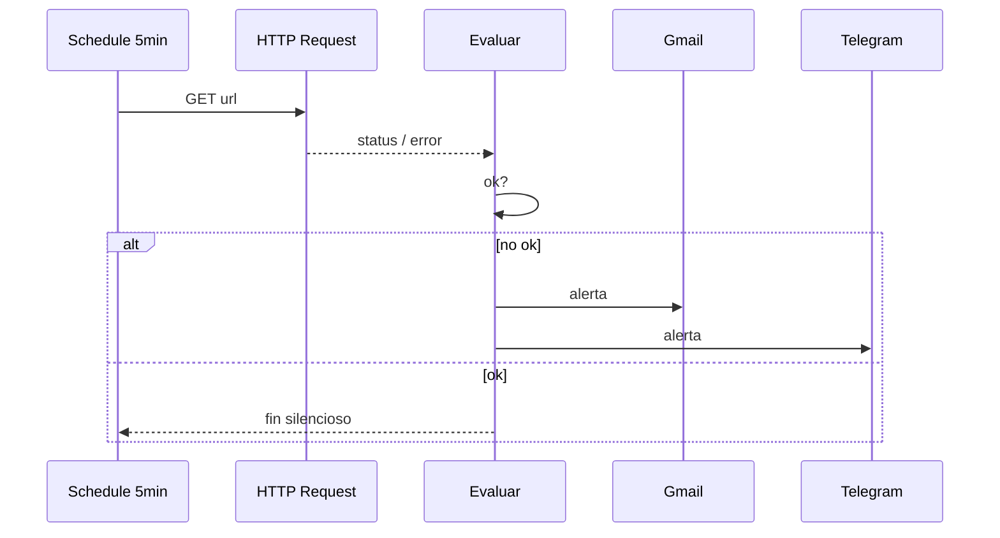
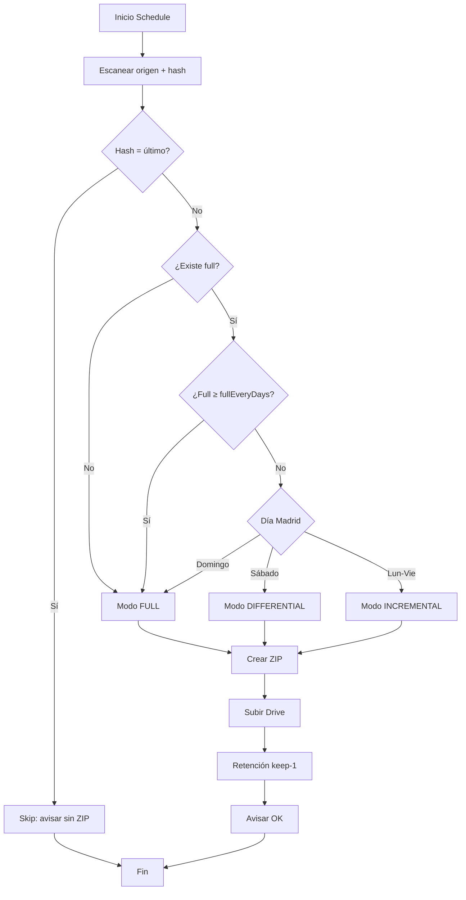
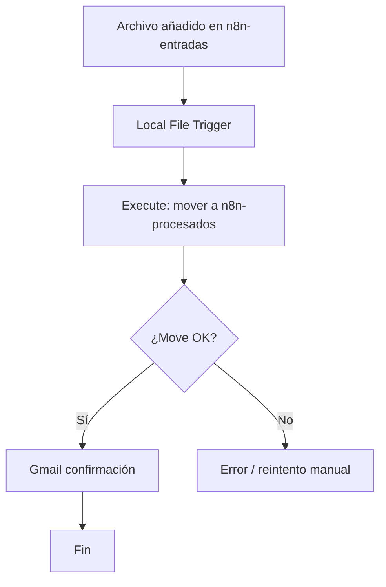
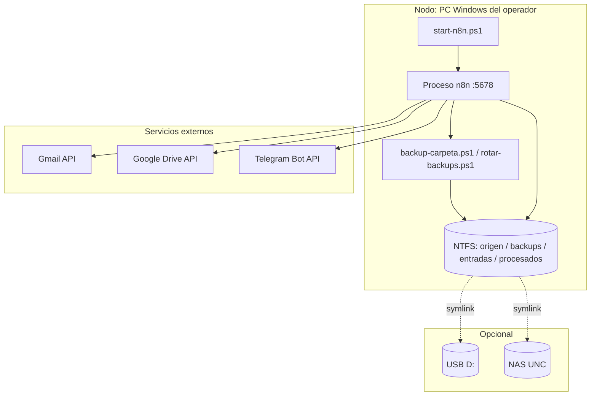
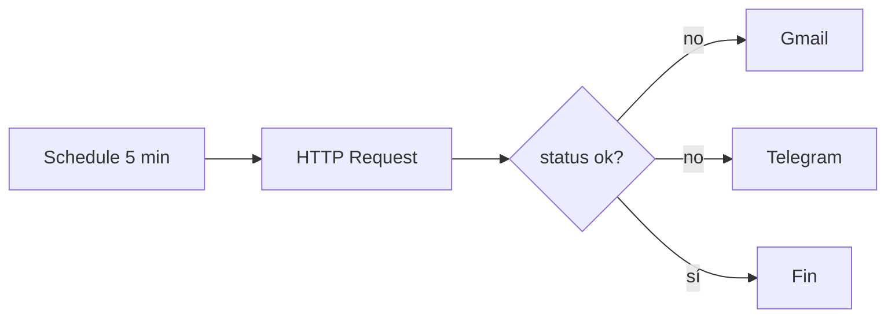
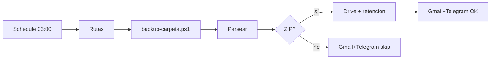
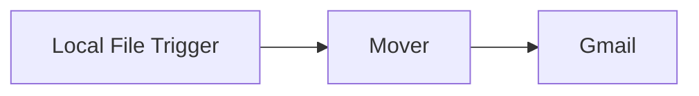

# Documentación — Workflows de sistemas (n8n local Windows)

Documentación de **requisitos funcionales/no funcionales**, **casos de uso**, **diagramas UML** (Mermaid) y enlace a **manuales** de la suite de automatización de sistemas en n8n self-hosted.

| Artefacto | Ruta |
|-----------|------|
| **Manual de usuario** | [`MANUAL_USUARIO_SISTEMAS.md`](./MANUAL_USUARIO_SISTEMAS.md) |
| **Manual de desarrollador** | [`MANUAL_DESARROLLADOR_SISTEMAS.md`](./MANUAL_DESARROLLADOR_SISTEMAS.md) |
| Guía operativa | [`configurar-workflows-sistemas.md`](./configurar-workflows-sistemas.md) |
| Arranque recomendado | [`start-n8n.ps1`](./start-n8n.ps1) |
| Uptime | [`workflows/sistemas-uptime-health.json`](./workflows/sistemas-uptime-health.json) |
| Vigilancia carpeta | [`workflows/sistemas-vigilancia-carpeta.json`](./workflows/sistemas-vigilancia-carpeta.json) |
| Backup + rotación | [`workflows/sistemas-backup-rotacion.json`](./workflows/sistemas-backup-rotacion.json) |
| Script ZIP auxiliar | [`workflows/backup-carpeta.ps1`](./workflows/backup-carpeta.ps1) |
| Script rotación ZIP | [`workflows/rotar-backups.ps1`](./workflows/rotar-backups.ps1) |
| Retención Drive (JS) | [`workflows/seleccionar-retencion-drive.js`](./workflows/seleccionar-retencion-drive.js) |
| Parsear resultado (JS) | [`workflows/parsear-resultado-backup-canvas.js`](./workflows/parsear-resultado-backup-canvas.js) |
| Telegram programado | [`workflows/telegram-mensaje-programado.json`](./workflows/telegram-mensaje-programado.json) · guía [`configurar-telegram-mensajes.md`](./configurar-telegram-mensajes.md) |

n8n de referencia: **2.22.6 (Self Hosted)** vía `npx n8n` / `start-n8n.ps1`.

---

## 1. Visión general

Cinco patrones de automatización de sistemas adaptados a Windows: monitor HTTP, backup local (+ nube), vigilancia de carpetas, deploy por webhook y auditoría de logs. Los tres primeros tienen JSON importable y pruebas locales documentadas.

> **Empieza aquí si no has seguido el chat:** la sección [2. Fichas por workflow](#2-fichas-por-workflow-lectura-rápida) resume qué hace / qué no hace / entradas-salidas de cada uno.


```mermaid
flowchart TB
  subgraph runtime [Runtime n8n Windows]
    ENV[NODES_EXCLUDE + N8N_RESTRICT_FILE_ACCESS_TO]
    N8N[n8n 2.x]
    ENV --> N8N
  end
  subgraph wf [Workflows]
    U[Uptime]
    B[Backup + rotación + Drive]
    C[Carpeta local]
    D[Deploy]
    L[Logs]
  end
  N8N --> U & B & C & D & L
  U & B & C -->|alerta/confirmación| G[Gmail]
  B -->|ZIP opcional| GD[Google Drive]
```

---

## 2. Fichas por workflow (lectura rápida)

Pensadas para alguien que **no** ha seguido la conversación de configuración. La guía paso a paso está en [`configurar-workflows-sistemas.md`](./configurar-workflows-sistemas.md).

### 2.1 Uptime / Health Check

| | |
|--|--|
| **Archivo** | [`workflows/sistemas-uptime-health.json`](./workflows/sistemas-uptime-health.json) |
| **Qué hace** | Cada **5 minutos** hace un GET HTTP a una URL configurada. Si el código no es 200–399 (o hay error de red), envía **email Gmail y Telegram** en paralelo. Si todo va bien, **no** notifica. |
| **Qué no hace** | No hace ping por defecto; no mira contenido HTML ni latencia SLA; no reinicia servicios; no sustituye a UptimeRobot/Prometheus. Una sola URL por ejecución (hay que duplicar el flujo o parametrizar para varias). |
| **Tipo de backup** | N/A |
| **Entradas** | Schedule 5 min; URL, nombre y `chatId` en «Definir objetivo»; credenciales Gmail + Telegram. |
| **Salidas** | Email + Telegram solo si falla; datos internos `ok` / `statusCode`. |
| **Estado** | Probado HTTP; Telegram cableado en el JSON (configurar chatId + credencial). |

### 2.2 Backup local + rotación + Google Drive

| | |
|--|--|
| **Archivo** | [`workflows/sistemas-backup-rotacion.json`](./workflows/sistemas-backup-rotacion.json) + [`backup-carpeta.ps1`](./workflows/backup-carpeta.ps1) + [`rotar-backups.ps1`](./workflows/rotar-backups.ps1) + [`seleccionar-retencion-drive.js`](./workflows/seleccionar-retencion-drive.js) |
| **Qué hace** | Hashea la carpeta origen (SHA-256). Sigue **symlinks/junctions** (USB, red, otro disco) bajo origen; omite `.lnk`. Sin cambios → **skip**. Con cambios → ZIP según **ciclo semanal Madrid** (`auto`: dom=full, lun–vie=incr, sáb=diff), sube a Drive, retención **máx. 1** full/diff/incr (local + Drive) y avisa Gmail + Telegram (OK / omitido / KO). |
| **Qué no hace** | No hace backup de BBDD salvo otro script; no cifra; no restaura solo; no versiona borrados como tombstones en diff/incr. |
| **Tipo de backup** | **Full + diferencial + incremental**, skip por hash, keep-one + cascada (full limpia diff/incr; diff limpia incr). |
| **Entradas** | `n8n-backup-origen` (ficheros + **symlinks/junctions** a USB/red/disco; ver guía); `mode=auto` / `fullEveryDays` / `chatId`; scripts `.ps1`; Gmail + Drive + Telegram. |
| **Salidas** | ZIP `backup_full|diff|incr_*.zip` o skip; estado en `.backup-state\`; Drive con ≤1 por tipo; **Gmail + Telegram**. |
| **Estado** | Scripts + JSON con retención Drive; **tras editar el canvas → Publish** (n8n 2.x ejecuta la versión publicada). |

### 2.3 Vigilancia de carpeta local

| | |
|--|--|
| **Archivo** | [`workflows/sistemas-vigilancia-carpeta.json`](./workflows/sistemas-vigilancia-carpeta.json) |
| **Qué hace** | Cuando aparece un **archivo nuevo** en `n8n-entradas`, lo **mueve** a `n8n-procesados` y envía un email con origen/destino. |
| **Qué no hace** | No parsea CSV ni OCR por defecto (solo está esbozado en la guía); no vigila subcarpetas de forma avanzada; no procesa el contenido del fichero; no sube a Drive. |
| **Tipo de backup** | N/A (es movimiento de archivo, no copia de seguridad). |
| **Entradas** | Local File Trigger (evento *add*) sobre la carpeta entradas; Execute Command (mover); Gmail. Requiere `NODES_EXCLUDE=[]`. |
| **Salidas** | Archivo en `n8n-procesados`; email de confirmación. |
| **Estado** | Probado (p. ej. PDF movido + email). |

### 2.4 Deploy (Webhook + git / Docker)

| | |
|--|--|
| **Archivo** | **No hay JSON importable**; solo patrón en la guía operativa. |
| **Qué hace** | (Diseño) Recibe un Webhook (p. ej. push a `main`), ejecuta un script local (`git pull` + `docker compose up -d`) y avisa por email/Telegram. |
| **Qué no hace** | No está montado ni probado en este repo; no expone el webhook sin túnel HTTPS; no es un CD completo (tests, rollback, secretos). |
| **Tipo de backup** | N/A |
| **Entradas** | Webhook GitHub + script de deploy en disco + (opcional) túnel. |
| **Salidas** | App/contenedor actualizado + notificación. |
| **Estado** | Solo documentación manual. |

### 2.5 Auditoría de logs / intentos de login

| | |
|--|--|
| **Archivo** | **No hay JSON importable**; solo patrón en la guía operativa. |
| **Qué hace** | (Diseño) Periódicamente lee eventos de seguridad (p. ej. fallos de login) y alerta si supera un umbral. |
| **Qué no hace** | No está montado ni probado aquí; no bloquea IPs por defecto (y no debería sin cuidado); no sustituye a un SIEM. |
| **Tipo de backup** | N/A |
| **Entradas** | Schedule + acceso a logs/Visor de eventos + umbral. |
| **Salidas** | Email crítico si hay anomalía. |
| **Estado** | Solo documentación manual. |

### 2.6 Telegram — mensaje programado

| | |
|--|--|
| **Archivo** | [`workflows/telegram-mensaje-programado.json`](./workflows/telegram-mensaje-programado.json) · [`configurar-telegram-mensajes.md`](./configurar-telegram-mensajes.md) |
| **Qué hace** | Cada día a las **09:00** (configurable) envía un texto a tu chat de Telegram. |
| **Qué no hace** | No escucha comandos del bot; no es conversacional (haría falta Telegram Trigger). |
| **Tipo de backup** | N/A |
| **Entradas** | Token BotFather, `chat_id`, Schedule, texto. |
| **Salidas** | Mensaje en Telegram. |
| **Estado** | JSON listo; falta crear bot + credencial en tu instancia. |

### Resumen rápido

| # | Workflow | JSON | Backup |
|---|----------|------|--------|
| 1 | Uptime | Sí | — |
| 2 | Backup + Drive | Sí | **Full + diff + incr** + skip por hash |
| 3 | Carpeta | Sí | — |
| 4 | Deploy | No | — |
| 5 | Logs | No | — |
| — | Telegram programado | Sí | — (mensajería, no backup) |

---

## 3. Requisitos funcionales (RF)

| ID | Requisito | Workflow | Estado |
|----|-----------|----------|--------|
| RF-01 | Comprobar cada N minutos que un endpoint HTTP responde 200 | Uptime | Probado (`localhost:5678`) |
| RF-02 | Si el status ≠ 200 (o error de red), enviar alerta Gmail **y Telegram** | Uptime | JSON con ambos canales |
| RF-03 | Crear ZIP de carpeta origen (full / diff / incr según modo) | Backup | Probado (scripts) |
| RF-04 | Retener como máximo 1 full + 1 diff + 1 incr (local y Drive) con cascada | Backup | Probado |
| RF-05 | Notificar Gmail (+ Telegram) resultado OK, skip o KO | Backup | JSON actualizado |
| RF-06 | Subir ZIP a Drive solo si se creó uno nuevo | Backup | Rama IF |
| RF-14 | Omitir ZIP/Drive si el hash de contenido no cambió | Backup | Probado |
| RF-15 | Ciclo semanal auto (dom=full, lun–vie=incr, sáb=diff, Madrid) | Backup | Probado (script) |
| RF-16 | Seguir symlinks/junctions bajo origen; omitir `.lnk`; fallar si destino inaccesible | Backup | Probado (script) |
| RF-17 | Informar cambios +/~/- u ORIGEN VACIADO en avisos | Backup | Probado |
| RF-07 | Detectar archivo nuevo en carpeta de entradas | Carpeta | Probado |
| RF-08 | Mover el archivo a carpeta procesados y avisar por Gmail | Carpeta | Probado |
| RF-09 | Ejecutar comandos PowerShell locales de forma controlada | Backup / Carpeta | Requiere `NODES_EXCLUDE=[]` |
| RF-10 | Leer binarios desde disco solo en rutas allow-list | Backup → Drive | Requiere `N8N_RESTRICT_FILE_ACCESS_TO` |
| RF-11 | Webhook + comandos de deploy (git/docker) | Deploy | Documentado (manual) |
| RF-12 | Auditar eventos de autenticación fallida | Logs | Documentado (manual) |
| RF-13 | Enviar mensaje de texto a Telegram en horario programado | Telegram | JSON listo |
| RF-18 | Publicar (Publish) la versión activa del workflow tras editar el canvas | Todos | Operativo n8n 2.x |

---

## 4. Requisitos no funcionales (RNF)

| ID | Tipo | Requisito |
|----|------|-----------|
| RNF-01 | Seguridad | Local File Trigger y Execute Command desactivados por defecto en n8n 2.x; se habilitan solo con `NODES_EXCLUDE='[]'` (o lista explícita sin excluirlos) |
| RNF-02 | Seguridad | Read/Write Files limitado por `N8N_RESTRICT_FILE_ACCESS_TO` (por defecto solo `~\.n8n-files`) |
| RNF-03 | Seguridad | No concatenar input de Webhook público en comandos sin sanitizar |
| RNF-04 | Portabilidad | Rutas Windows absolutas (`C:\Users\…`); expresiones con `/` y `trim` para el nodo de archivos |
| RNF-05 | Operación | Arranque reproducible vía `start-n8n.ps1` y variables de entorno de **Usuario** Windows |
| RNF-06 | Disponibilidad | Tras **cada** cambio en el canvas → **Publish**; Schedule / triggers usan la versión publicada (n8n 2.x), no el borrador |
| RNF-07 | Observabilidad | Confirmación o alerta por Gmail (`gracobjo@gmail.com` en entorno de prueba) |
| RNF-08 | Retención | Máx. 1 full + 1 diff + 1 incr (local y Drive); cascada full→limpia diff/incr, diff→limpia incr |
| RNF-09 | Integración | Google Drive OAuth2 + **Google Drive API** habilitada en el proyecto de Google Cloud |
| RNF-10 | Usabilidad | Fichas «qué hace / qué no hace» en §2 + manuales de usuario/desarrollador |
| RNF-11 | Mantenibilidad | Scripts parametrizados; parseo sin depender del nombre del nodo Set |
| RNF-12 | Fiabilidad | OAuth Gmail/Drive renovable; fallo de notificación no debe confundirse con fallo de backup sin revisar ejecuciones |
| RNF-13 | Rendimiento | Hash SHA-256 de árboles grandes (p. ej. Documents completo) puede alargar la ventana 03:00 |
| RNF-14 | Documentación | UML Mermaid (§7) y guías de symlinks / Publish actualizadas con el producto |
### Variables de entorno persistidas (Usuario Windows)

Quedan fijadas a nivel **User** (nuevas terminales / sesión tras relogin o abrir PowerShell nuevo):

| Variable | Valor |
|----------|--------|
| `NODES_EXCLUDE` | `[]` |
| `N8N_RESTRICT_FILE_ACCESS_TO` | `%USERPROFILE%\n8n-backups;%USERPROFILE%\n8n-backup-origen;%USERPROFILE%\n8n-entradas;%USERPROFILE%\n8n-procesados;%USERPROFILE%\.n8n-files` |
| `N8N_COMMUNITY_PACKAGES_ENABLED` | `true` |
| `GENERIC_TIMEZONE` | `Europe/Madrid` (hora de España peninsular; Canarias: `Atlantic/Canary`) |

Script equivalente: [`start-n8n.ps1`](./start-n8n.ps1).

```powershell
# Arranque recomendado
powershell -File C:\Users\chuwi\Documents\n8n\start-n8n.ps1
```

Si la sesión actual se abrió **antes** de fijar las variables de Usuario, cierra la terminal o exporta en la sesión:

```powershell
$env:NODES_EXCLUDE = '[]'
$env:N8N_RESTRICT_FILE_ACCESS_TO = "$env:USERPROFILE\n8n-backups;$env:USERPROFILE\n8n-backup-origen;$env:USERPROFILE\.n8n-files"
npx n8n
```

---

## 5. Casos de uso

| ID | Actor | Caso de uso | Flujo principal | Resultado |
|----|-------|-------------|-----------------|-----------|
| CU-01 | Operador | Detectar caída de servicio HTTP | Schedule → HTTP GET → IF ≠ OK → Gmail+Telegram | Alerta |
| CU-02 | Operador | Backup programado de carpetas críticas | Schedule 03:00 → `.ps1` → skip o ZIP → retención → avisos | ZIP/skip + Gmail/Telegram |
| CU-03 | Operador | Copia en la nube del ZIP nuevo | … → Read binary → Drive Upload → retención Drive | ≤1 full/diff/incr en Drive |
| CU-04 | Usuario local | Archivo cae en bandeja de entrada | Local File Trigger → mover → Gmail | Archivo en `n8n-procesados` |
| CU-05 | CI/Dev | Deploy tras push (manual) | Webhook → Execute Command | Contenedor/app actualizada |
| CU-06 | Seguridad | Revisar intentos de login fallidos | Schedule → parse log → IF umbral → Gmail | Alerta crítica |
| CU-07 | Operador | Incluir USB/red vía symlink | Crear enlace en origen → backup sigue destino | Ficheros en ZIP bajo prefijo del enlace |
| CU-08 | Operador | Recibir mensaje Telegram programado | Schedule → Telegram | Mensaje diario |

### 5.1 CU-01 — Uptime (especificación)

| Campo | Contenido |
|-------|-----------|
| **Actor** | Operador |
| **Precondiciones** | n8n en marcha; workflow Published; URL y `chatId` en Set; credenciales Gmail/Telegram válidas |
| **Trigger** | Schedule cada 5 minutos |
| **Flujo principal** | 1) GET URL 2) Evaluar status 200–399 3) Si OK → fin sin aviso |
| **Flujo alternativo** | Status error o red → Gmail + Telegram en paralelo |
| **Postcondiciones** | Ejecución registrada; alerta solo si falló |
| **Excepciones** | OAuth Gmail caducado → error en nodo Gmail (Telegram puede seguir OK) |

### 5.2 CU-02 — Backup programado (especificación)

| Campo | Contenido |
|-------|-----------|
| **Actor** | Operador (pasivo); sistema Schedule |
| **Precondiciones** | Carpetas origen/backups; scripts en disco; `mode=auto`; timezone Madrid |
| **Trigger** | Schedule ~03:00 |
| **Flujo principal** | 1) Hashear origen (symlinks incluidos) 2) Si hash igual → skip + avisos 3) Si no → elegir modo por día 4) ZIP 5) Drive + retención 6) Avisos OK |
| **Flujos alternativos** | Origen vaciado → full vacío + mensaje ORIGEN VACIADO; enlace roto → `status=error` + KO |
| **Postcondiciones** | Estado `.backup-state` actualizado si `created`; ≤1 ZIP por tipo tras retención |
| **Excepciones** | Ver tabla Drive §5.3; Gmail token inválido |

### 5.3 CU-03 — Upload Drive (especificación)

**Precondiciones:** Drive API habilitada; OAuth Google Drive en n8n; carpeta destino con ID conocido; nodo Drive **activado**; allow-list de archivos incluye `n8n-backups`.

**Pasos:**

1. Backup local genera `zipPath` / `zipPathPosix` / `fileName` (`status=created`).
2. Read/Write Files (Read) carga el ZIP en binary field `data`.
3. Google Drive (File / Upload) sube `data` a Parent Drive `root` + Parent Folder By ID.
4. Listar ZIPs de la carpeta → seleccionar borrados (keep-1) → borrar si aplica.
5. Rotación local + email/Telegram (incluyen texto de retención Drive).

**Postcondiciones:** El ZIP nuevo existe en Drive; como máximo un ZIP por tipo; el local sigue la misma política.

**Excepciones:**

| Error | Causa | Acción |
|-------|--------|--------|
| `No file(s) found` | Ruta mal formada o fuera del allow-list | `trim` + `/` + `N8N_RESTRICT_FILE_ACCESS_TO` |
| 403 Drive API | API no habilitada | Enable API + reconnect OAuth |
| 404 `File not found: <folderId>` | Carpeta borrada o ID incorrecto | Nueva carpeta + ID en nodo |
| Skip tras vaciar Drive | Hash local intacto | `.backup-state` o `-Force` |
| Nodo no corre | Disabled / no Published | Activate + Publish |

### 5.4 CU-04 — Vigilancia carpeta (especificación)

| Campo | Contenido |
|-------|-----------|
| **Actor** | Usuario local |
| **Precondiciones** | `NODES_EXCLUDE=[]`; carpetas entradas/procesados; workflow Active+Published |
| **Trigger** | Archivo **añadido** en `n8n-entradas` |
| **Flujo principal** | Trigger → Move (PowerShell) → Gmail confirmación |
| **Postcondiciones** | Archivo solo en `n8n-procesados` |
| **Excepciones** | Nombre con caracteres raros; Gmail OAuth; trigger no instalado |

### 5.5 CU-07 — Symlink USB/red (especificación)

| Campo | Contenido |
|-------|-----------|
| **Actor** | Operador |
| **Precondiciones** | Destino existe; privilegios para `SymbolicLink` |
| **Flujo** | Crear enlace bajo origen → próximo backup con cambios incluye árbol remoto |
| **Excepción** | Destino offline → error de escaneo (KO) salvo `-AllowBrokenLinks` |
| **Fuera de alcance** | URLs `https://…` como Target (no soportado por Windows) |

## 6. Google Drive — configuración completa

### 6.1 Habilitar Google Drive API (obligatorio)

Sin esto el upload falla con **403** aunque el OAuth de Gmail/Sheets funcione.

1. Abre [Google Cloud Console](https://console.cloud.google.com/) → el proyecto OAuth de n8n (en la prueba: proyecto numérico `947509817186`).
2. **APIs & Services → Library** → busca **Google Drive API**.
3. **Enable**.
4. Espera 1–2 minutos; si sigue 403, en n8n **Credentials → Google Drive → Reconnect** / volver a autorizar scopes de Drive.
5. Comprueba en [Google Drive API](https://console.cloud.google.com/apis/library/drive.googleapis.com) que aparece **Enabled**.

Scopes habituales del nodo: acceso a archivos de Drive del usuario autenticado (no hace falta Service Account para el caso personal).

### 6.2 Credencial en n8n

| Campo | Valor |
|-------|--------|
| Tipo | **Google Drive OAuth2 API** |
| Cuenta de prueba | misma familia que Gmail (`gracobjo@gmail.com`) |
| Consent | Pantalla OAuth del mismo proyecto Cloud |

### 6.3 Carpeta destino

1. En [drive.google.com](https://drive.google.com) crea p. ej. `n8n-backups` (si la borraste, **crea otra**: el ID cambia).
2. Entra en la carpeta; URL:

```text
https://drive.google.com/drive/folders/<ID_DE_TU_CARPETA>
```

3. Copia solo el ID tras `/folders/`.  
   **No** uses la URL de «Mi unidad» (`.../my-drive`).  
   Un ID de carpeta eliminada provoca `404 File not found: <id>`.

Ejemplo histórico (invalidado si se borró la carpeta): `18NmjbymVBtT4BTQuIHUg-7kEhFBswO2r`.

### 6.4 Nodos y parámetros (canvas)

```text
Parsear ruta ZIP
  → Read/Write Files from Disk (Read)
  → Subir a Google Drive (en la cadena, no solo “Execute step”)
  → Rotacion +7 dias
  → Gmail
```

Si Drive no está cableado entre Parsear y Rotación, el email dirá *«no ejecutado»* aunque un Execute step manual hubiera subido un ZIP antes.

| Nodo | Parámetro | Valor correcto |
|------|-----------|----------------|
| Parsear ruta ZIP | Salida | `zipPath`, `zipPathPosix`, `fileName` (trim, sin espacio inicial) |
| Read/Write Files | Operation | **Read** |
| Read/Write Files | File(s) Selector | `{{ $json.zipPathPosix }}` o `{{ String($json.zipPath).trim().replace(/\\/g, '/') }}` |
| Read/Write Files | Put Output File in Field | `data` |
| Google Drive | Resource / Operation | **File** / **Upload** |
| Google Drive | Input Data Field Name | `data` |
| Google Drive | File Name | `{{ $('Parsear ruta ZIP').item.json.fileName }}` |
| Google Drive | Parent Drive | **By ID** = `root` |
| Google Drive | Parent Folder | **By ID** = ID **vigente** de tu carpeta (no uno borrado) |
| Rotacion +7 dias | Command | `-File ...\rotar-backups.ps1` (no `-Command` con `$dir`/`$days`) |
| Gmail backup OK | Message | Enlace Drive vía `$('Subir a Google Drive').isExecuted` + `id` / `webViewLink` |

**Notas:**

- **From list** en gris es normal si la credencial no lista drives; **By ID** basta.
- Parent Drive = ID de carpeta → incorrecto; carpeta va solo en Parent Folder.
- Drive debe estar **en la cadena** del Test workflow; un Execute step suelto no cuenta para el email.
- Tras Drive, `$json` ya no trae `backupDir`: Rotacion lee `$('Parsear ruta ZIP')` o usa el `.ps1` con esos args.

### 6.5 Trampa Execute Command + `$` (rotación)

En campos Command con modo expresión (`=` / fx), n8n interpreta tokens como `$dir`, `$days`, `$limit` como variables n8n. Quedan vacíos y PowerShell falla (`$days = ;`, rutas partidas con `\n7`).

**Correcto:** llamar a [`rotar-backups.ps1`](./workflows/rotar-backups.ps1) con `-BackupDir` / `-DaysToKeep`, o escapar dólares PowerShell como `$$` en la expresión.

### 6.6 Diagrama de secuencia — upload Drive

```mermaid
sequenceDiagram
  participant Sch as Schedule
  participant Cmd as Execute Command
  participant Par as Parsear ZIP
  participant Rd as Read Files
  participant Dr as Google Drive API
  participant Gm as Gmail

  Sch->>Cmd: PowerShell ZIP origen→backups
  Cmd->>Par: stdout con ruta .zip
  Par->>Rd: zipPathPosix
  Rd->>Rd: binary data (allow-list)
  Rd->>Dr: files.create (OAuth + Drive API ON)
  Note over Dr: Parent drive=root<br/>folder=18Nmjbym…
  Dr-->>Rd: file metadata
  Rd->>Gm: confirmación (vía nodos siguientes)
```

---

## 7. Diagramas UML

Los diagramas usan **Mermaid** (visibles en GitHub / muchos visores Markdown). Modelan la suite de sistemas, no el núcleo completo del producto n8n open-source.

### 7.1 Diagrama de casos de uso


```mermaid
flowchart LR
  Op((Operador))
  Us((Usuario local))
  Dev((Dev/CI))
  Sec((Seguridad))
  Sys((Schedule / Trigger))

  Op --> CU1[CU-01 Uptime]
  Op --> CU2[CU-02 Backup local]
  Op --> CU3[CU-03 Backup Drive]
  Op --> CU7[CU-07 Symlinks origen]
  Op --> CU8[CU-08 Telegram programado]
  Us --> CU4[CU-04 Vigilancia carpeta]
  Dev --> CU5[CU-05 Deploy]
  Sec --> CU6[CU-06 Auditoría logs]
  Sys -.-> CU1
  Sys -.-> CU2
  Sys -.-> CU8
```

### 7.2 Diagrama de clases (estructura estática)

Entidades de dominio del kit (no son clases TypeScript del monorepo n8n; representan el modelo lógico).


```mermaid
classDiagram
  direction TB
  class N8nInstance {
    +version: string
    +timezone: string
    +start()
    +publish(workflow)
  }
  class Workflow {
    +name: string
    +active: bool
    +published: bool
  }
  class ScheduleTrigger {
    +cronOrInterval: string
  }
  class BackupJob {
    +sourcePath: string
    +backupDir: string
    +mode: auto|full|diff|incr
    +chatId: string
    +run()
  }
  class BackupScript {
    +buildManifest()
    +followSymlinks: bool
    +emitJson()
  }
  class Manifest {
    +contentHash: string
    +fileCount: int
    +files: FileEntry[]
    +linkedRoots: LinkRoot[]
  }
  class FileEntry {
    +path: string
    +sha256: string
    +length: long
  }
  class LinkRoot {
    +path: string
    +target: string
    +type: string
  }
  class RetentionPolicy {
    +keepFull: 1
    +keepDiff: 1
    +keepIncr: 1
    +applyAfterMode(mode)
  }
  class DriveStore {
    +folderId: string
    +upload(zip)
    +deleteOld()
  }
  class Notifier {
    +sendGmail()
    +sendTelegram()
  }
  class UptimeCheck {
    +url: string
    +probe()
  }
  class FolderWatch {
    +entradas: string
    +procesados: string
    +onFileAdd()
  }

  N8nInstance "1" --> "*" Workflow
  Workflow --> ScheduleTrigger
  Workflow --> BackupJob
  Workflow --> UptimeCheck
  Workflow --> FolderWatch
  BackupJob --> BackupScript
  BackupScript --> Manifest
  Manifest --> FileEntry
  Manifest --> LinkRoot
  BackupJob --> RetentionPolicy
  BackupJob --> DriveStore
  BackupJob --> Notifier
  UptimeCheck --> Notifier
  FolderWatch --> Notifier
```

### 7.3 Diagrama de secuencia — backup con cambios (happy path)

```mermaid
sequenceDiagram
  participant Sch as Schedule 03:00
  participant Set as Rutas backup
  participant Ps as backup-carpeta.ps1
  participant Par as Parsear resultado
  participant Rd as Leer ZIP
  participant Dr as Google Drive
  participant Ret as Retención Drive+local
  participant N as Gmail/Telegram

  Sch->>Set: trigger
  Set->>Ps: ExecuteCommand (paths, mode, chatId)
  Ps->>Ps: manifest + hash (symlinks)
  alt hash igual
    Ps-->>Par: status=skipped
    Par->>N: sin cambios
  else cambios
    Ps-->>Par: status=created + zipPath
    Par->>Rd: zipPathPosix
    Rd->>Dr: upload ZIP
    Dr->>Ret: listar / borrar keep-1
    Ret->>Ret: rotar-backups.ps1 -AfterMode
    Ret->>N: OK + textos retención
  end
```

### 7.4 Diagrama de secuencia — uptime en fallo


```mermaid
sequenceDiagram
  participant Sch as Schedule 5min
  participant Http as HTTP Request
  participant Ev as Evaluar
  participant Gm as Gmail
  participant Tg as Telegram

  Sch->>Http: GET url
  Http-->>Ev: status / error
  Ev->>Ev: ok?
  alt no ok
    Ev->>Gm: alerta
    Ev->>Tg: alerta
  else ok
    Ev-->>Sch: fin silencioso
  end
```

### 7.5 Diagrama de actividades — decisión de modo backup (`auto`)


```mermaid
flowchart TD
  A[Inicio Schedule] --> B[Escanear origen + hash]
  B --> C{Hash = último?}
  C -->|Sí| D[Skip: avisar sin ZIP]
  C -->|No| E{¿Existe full?}
  E -->|No| F[Modo FULL]
  E -->|Sí| G{¿Full ≥ fullEveryDays?}
  G -->|Sí| F
  G -->|No| H{Día Madrid}
  H -->|Domingo| F
  H -->|Sábado| I[Modo DIFFERENTIAL]
  H -->|Lun-Vie| J[Modo INCREMENTAL]
  F --> K[Crear ZIP]
  I --> K
  J --> K
  K --> L[Subir Drive]
  L --> M[Retención keep-1]
  M --> N[Avisar OK]
  D --> Z[Fin]
  N --> Z
```

### 7.6 Diagrama de actividades — vigilancia de carpeta


```mermaid
flowchart TD
  A[Archivo añadido en n8n-entradas] --> B[Local File Trigger]
  B --> C[Execute: mover a n8n-procesados]
  C --> D{¿Move OK?}
  D -->|Sí| E[Gmail confirmación]
  D -->|No| F[Error / reintento manual]
  E --> G[Fin]
```

### 7.7 Diagrama de despliegue


```mermaid
flowchart TB
  subgraph pc [Nodo: PC Windows del operador]
    PS[start-n8n.ps1]
    N8N[Proceso n8n :5678]
    Disk[(NTFS: origen / backups / entradas / procesados)]
    Scripts[backup-carpeta.ps1 / rotar-backups.ps1]
    PS --> N8N
    N8N --> Scripts
    Scripts --> Disk
    N8N --> Disk
  end

  subgraph cloud [Servicios externos]
    Gmail[Gmail API]
    Drive[Google Drive API]
    TG[Telegram Bot API]
  end

  subgraph optional [Opcional]
    USB[(USB D:)]
    NAS[(NAS UNC)]
  end

  N8N --> Gmail
  N8N --> Drive
  N8N --> TG
  Disk -.symlink.-> USB
  Disk -.symlink.-> NAS
```

### 7.8 Flujos resumidos por workflow (actividad simplificada)

#### Uptime


```mermaid
flowchart LR
  S[Schedule 5 min] --> H[HTTP Request]
  H --> I{status ok?}
  I -->|no| G[Gmail]
  I -->|no| T[Telegram]
  I -->|sí| X[Fin]
```

#### Backup


```mermaid
flowchart LR
  S[Schedule 03:00] --> R[Rutas]
  R --> Z[backup-carpeta.ps1]
  Z --> P[Parsear]
  P --> I{ZIP?}
  I -->|sí| DR[Drive + retención]
  DR --> G[Gmail+Telegram OK]
  I -->|no| SK[Gmail+Telegram skip]
```

#### Vigilancia


```mermaid
flowchart LR
  T[Local File Trigger] --> M[Mover]
  M --> G[Gmail]
```

## 8. Carpetas locales de trabajo

| Carpeta | Uso |
|---------|-----|
| `%USERPROFILE%\n8n-entradas` | Vigilancia: archivos nuevos |
| `%USERPROFILE%\n8n-procesados` | Destino tras procesar |
| `%USERPROFILE%\n8n-backup-origen` | Contenido a comprimir |
| `%USERPROFILE%\n8n-backups` | ZIP `backup_YYYY-MM-DD_HHMM.zip` |
| `%USERPROFILE%\.n8n-files` | Allow-list por defecto de n8n 2.x |

---

## 9. Matriz de pruebas (entorno local)

| Prueba | Resultado |
|--------|-----------|
| Uptime → `http://localhost:5678` | HTTP 200, sin alerta |
| Carpeta → PDF en entradas | Movido + email OK |
| Backup ZIP + rotación | ZIP creado; rotación vía `rotar-backups.ps1`; email con `deleted=0` |
| Read binary ZIP | OK tras allow-list + path sin espacio |
| Drive en cadena completa | Cable Parsear → Leer → Drive → Rotacion; email con `open?id=` |
| Drive 404 folderId | Carpeta borrada; crear nueva y actualizar Parent Folder By ID |
| Skip tras vaciar Drive | Esperado; borrar `.backup-state` o `-Force` |

---

## 10. Historial de configuración (2026-09-04)

- Habilitados Local File Trigger / Execute Command con `NODES_EXCLUDE='[]'`.
- Allow-list de ficheros ampliada con `N8N_RESTRICT_FILE_ACCESS_TO`.
- Corregido espacio inicial en `zipPath`; añadido `zipPathPosix`.
- Google Drive: Parent Drive By ID `root`; Parent Folder = ID **vigente** (el `18Nmjbym…` histórico deja de valer si se borra la carpeta → 404).
- 403 resuelto habilitando **Google Drive API** en proyecto Cloud `947509817186`.
- Variables de Usuario + `start-n8n.ps1` para persistir el arranque.
- Email Gmail: quitada nota «Drive desactivado»; muestra enlace si el nodo se ejecutó.
- Cadena obligatoria Parsear → Leer ZIP → Drive → Rotacion (Drive suelto no cuenta).
- Rotación migrada a `rotar-backups.ps1` por conflicto `$` en Execute Command.
- Añadidas fichas por workflow (§2): qué hace / qué no hace / tipo de backup / entradas-salidas.
- `GENERIC_TIMEZONE=Europe/Madrid` en arranque; guía Telegram con mapa «dónde se configura» (chat_id, credencial, timezone workflow vs nodo).
- Backup: hash SHA-256, skip si sin cambios, full/diff/incr; vaciar Drive no fuerza re-subida (borrar `.backup-state` o `-Force`).
- Ciclo semanal `auto` (Madrid): dom=full, lun–vie=incr, sáb=diff; retención max 1 por tipo en local y Drive.
- **Publish obligatorio** tras cada edición del canvas (n8n 2.x: el cron usa la versión publicada).
- Symlinks/junctions bajo origen (USB/red/disco); omite `.lnk`; URLs https no son Target válidos.
- Manuales: [`MANUAL_USUARIO_SISTEMAS.md`](./MANUAL_USUARIO_SISTEMAS.md), [`MANUAL_DESARROLLADOR_SISTEMAS.md`](./MANUAL_DESARROLLADOR_SISTEMAS.md).
- UML ampliado §7: clases, CU, secuencia, actividad, despliegue.
- JSON Drive usa placeholder `PEGAR_ID_CARPETA_GOOGLE_DRIVE` (actualizar tras recrear carpeta).
